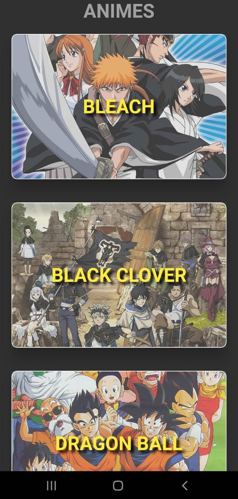
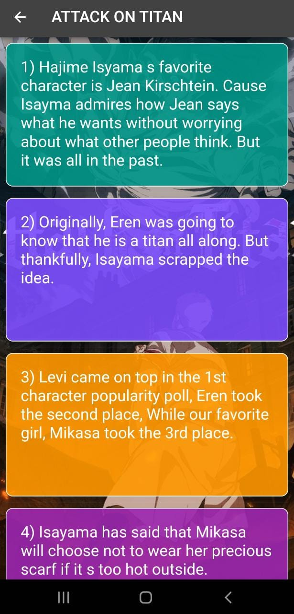

# Anime Facts

## Info -

- A beautiful app to know some unique facts about some popular animes built by consuming [This API](https://chandan-02.github.io/anime-facts-rest-api/).
- This App is built using [mobX](https://pub.dev/packages/mobx).
- On clicking an anime card in home screen it leads to facts screen where unique facts about the respective anime is displayed in randomly colored cards. These colors change everytime you click a card.

## How it looks -

  
   

